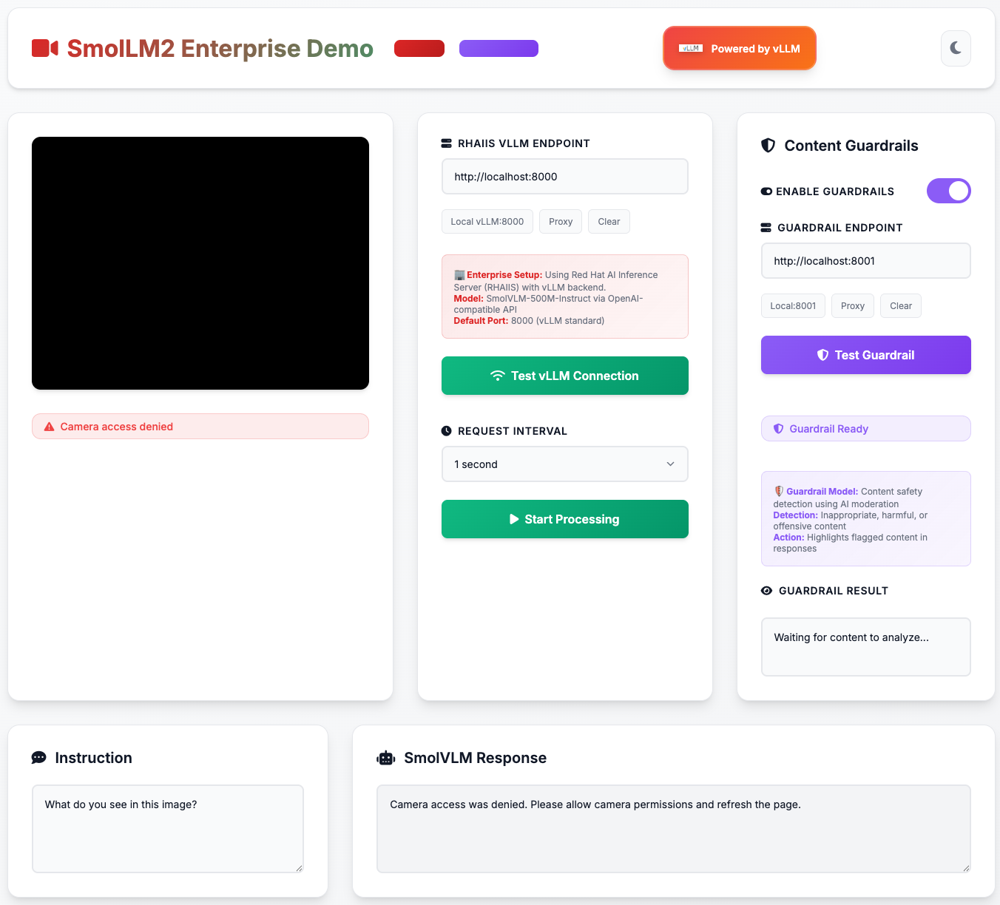

# SmolVLM Real-time Camera Demo



This repository is a simple demo for how to use llama.cpp server with SmolVLM 500M to get real-time object detection from your camera feed. The demo provides a web interface that captures camera frames and sends them to the SmolVLM model for analysis.

## Features

- Real-time camera feed processing
- Customizable AI instructions
- Adjustable frame capture intervals
- Web-based interface
- Multiple deployment options

## Deployment Options

Choose the deployment method that best fits your needs:

### 🖥️ Local Development Setup

Perfect for development and testing on your local machine.

#### Prerequisites
- [llama.cpp](https://github.com/ggml-org/llama.cpp) installed
- A modern web browser with camera access

#### Setup Instructions

1. **Install llama.cpp**
   ```bash
   git clone https://github.com/ggml-org/llama.cpp.git
   cd llama.cpp
   make
   ```

2. **Start the llama.cpp server**
   ```bash
   llama-server -hf ggml-org/SmolVLM-500M-Instruct-GGUF
   ```
   
   **Notes:**
   - Add `-ngl 99` to enable GPU acceleration (NVIDIA/AMD/Intel GPU)
   - You can try other models from [here](https://github.com/ggml-org/llama.cpp/blob/master/docs/multimodal.md)
   - First run will download the model (~2GB)

3. **Open the web interface**
   ```bash
   # Simply open index.html in your browser
   open index.html
   ```

4. **Start using the demo**
   - Grant camera permissions when prompted
   - Optionally modify the instruction (e.g., "Describe what you see in JSON format")
   - Adjust the capture interval (default: 500ms)
   - Click "Start" and enjoy real-time AI vision!

---

### 🐳 Local Container Deployment

Run the complete stack in a single container using Podman or Docker.

#### Prerequisites
- Podman or Docker installed
- 4GB+ RAM available
- 2+ CPU cores recommended

#### Quick Start

1. **Build the container**
   ```bash
   podman build -t smolvlm-demo:latest -f Containerfile .
   ```

2. **Run the container**
   ```bash
   podman run -p 8080:80 --name smolvlm-demo smolvlm-demo:latest
   ```

3. **Access the demo**
   - Open http://localhost:8080 in your browser
   - Grant camera permissions
   - Start detecting objects!

#### Container Architecture
The container includes:
- **llama.cpp server**: Serves the SmolVLM model on port 8080
- **Nginx web server**: Serves the HTML frontend on port 80 and proxies API calls
- **Supervisor**: Manages both services automatically

#### Container Management

```bash
# View logs
podman logs -f smolvlm-demo

# Stop the container
podman stop smolvlm-demo

# Remove the container
podman rm smolvlm-demo

# Remove the image
podman rmi smolvlm-demo:latest
```

---

### ☁️ OpenShift Deployment

Deploy to OpenShift for production use with automatic scaling and management.

#### Prerequisites
- Access to an OpenShift cluster
- `oc` CLI tool installed and configured
- Container registry access (e.g., Quay.io)

#### Deployment Steps

1. **Build and push the container image**
   ```bash
   # Build for OpenShift (x86_64)
   podman build --platform linux/amd64 -t your-registry/smolvlm-demo:latest -f Containerfile .
   
   # Push to registry
   podman push your-registry/smolvlm-demo:latest
   ```

2. **Update the deployment configuration**
   
   Edit `openshift-deployment.yaml` and update the image reference:
   ```yaml
   spec:
     template:
       spec:
         containers:
         - name: smolvlm-demo
           image: your-registry/smolvlm-demo:latest  # Update this line
   ```

3. **Deploy to OpenShift**
   ```bash
   # Create a new project (optional)
   oc new-project smolvlm-demo
   
   # Deploy the application
   oc apply -f openshift-deployment.yaml
   
   # Check deployment status
   oc get pods
   oc get services
   oc get routes
   ```

4. **Access the application**
   ```bash
   # Get the route URL
   oc get route smolvlm-realtime-demo-route
   
   # Access the demo using the provided HTTPS URL
   ```

#### OpenShift Features
- **Automatic HTTPS**: Routes provide SSL termination
- **High Availability**: Automatic pod restart and health checks
- **Resource Management**: CPU and memory limits/requests
- **Scaling**: Manual or automatic scaling based on load
- **Security**: Network policies and security contexts

#### Monitoring and Troubleshooting

```bash
# Check application logs
oc logs -f deployment/smolvlm-realtime-demo

# Check pod status
oc describe pod -l app=smolvlm-realtime-demo

# Scale the deployment
oc scale deployment/smolvlm-realtime-demo --replicas=2

# Update the deployment
oc rollout restart deployment/smolvlm-realtime-demo
```

## Usage Guide

1. **Camera Access**: Grant browser permission to access your camera
2. **Customize Instructions**: Modify the prompt to get different types of responses:
   - "What objects do you see?" (default)
   - "Describe the scene in detail"
   - "List all visible objects in JSON format"
   - "What colors are prominent in this image?"
3. **Adjust Interval**: Control how frequently frames are captured and analyzed
4. **View Responses**: AI responses appear in real-time below the camera feed

## Performance Considerations

- **Model Loading**: First startup takes 2-5 minutes to download the model
- **Hardware Requirements**: 
  - Minimum: 4GB RAM, 2 CPU cores
  - Recommended: 8GB RAM, 4 CPU cores
  - GPU acceleration significantly improves performance
- **Network**: Stable internet connection required for model download
- **Browser**: Modern browsers with WebRTC support required

## Troubleshooting

### Common Issues

1. **Camera not working**: Ensure HTTPS access and grant browser permissions
2. **Model loading slowly**: First run downloads ~2GB model; subsequent runs are faster
3. **High CPU usage**: Consider enabling GPU acceleration with `-ngl 99`
4. **CORS errors**: Use the container deployment for proper CORS handling

### Getting Help

- Check the logs for error messages
- Ensure all prerequisites are installed
- Verify network connectivity for model downloads
- Try different models if SmolVLM doesn't work well for your use case

## Customization

### Using Different Models
You can experiment with other vision models supported by llama.cpp:
- Modify the model name in the server command
- See [llama.cpp multimodal docs](https://github.com/ggml-org/llama.cpp/blob/master/docs/multimodal.md) for options

### UI Modifications
Edit `index.html` to customize:
- Interface styling and layout
- Default instructions and intervals
- Response formatting and display

## Contributing

Feel free to submit issues and pull requests to improve this demo!

## License

See [LICENSE](LICENSE) file for details.
